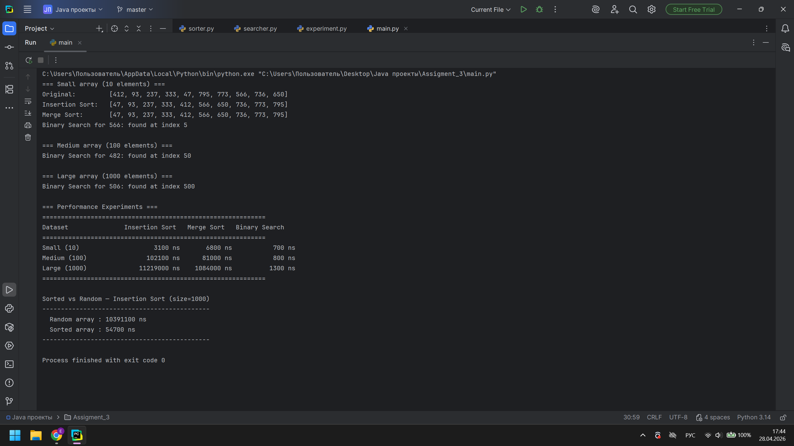
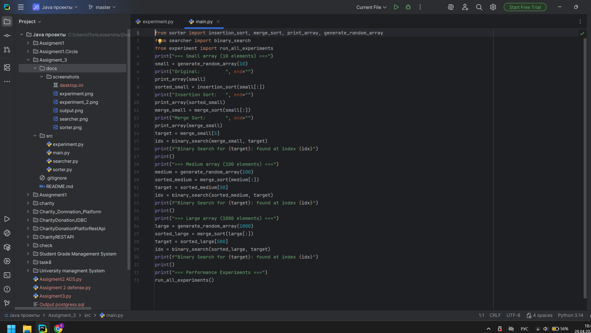

# Student: Pribylyov Yegor
# Group: SE-2514
# Assignment 3: Sorting and Searching Algorithm Analysis
# Project Overview
This project implements and compares three algorithms: Insertion Sort, Merge Sort, and Binary Search.
The goal is to measure and analyze their performance on different array sizes and input types.
# Algorithm Descriptions
# Insertion Sort (Basic Sorting) O(n²)
Goes through the array from left to right. Each element is picked and inserted into its correct position among the already-sorted elements to its left. Simple but slow on large arrays.
# Merge Sort (Advanced Sorting) O(n log n)
Divides the array in half recursively until single elements remain, then merges them back in sorted order. Much faster than Insertion Sort on large data.
# Binary Search (Searching) O(log n)
Requires a sorted array. Compares the target with the middle element, then eliminates half of the remaining array each step. Very fast even on large arrays.
# Experimental Results
# Performance Table (Random Arrays)

| Dataset       | Insertion Sort | Merge Sort   | Binary Search |
|---------------|----------------|--------------|---------------|
| Small (10)    | 3 100 ns       | 6 800 ns     | 700 ns        |
| Medium (100)  | 102 100 ns     | 81 000 ns    | 800 ns        |
| Large (1000)  | 11 219 000 ns  | 1 084 000 ns | 1 300 ns      |

# Sorted vs Random — Insertion Sort (size=1000)

| Input Type   | Time           |
|--------------|----------------|
| Random array | 10 391 100 ns  |
| Sorted array | 54 700 ns      |

# Analysis
**Which sorting algorithm performed faster?**
Merge Sort is faster on medium and large arrays because its complexity is O(n log n) vs O(n²) for Insertion Sort. On small arrays (10 elements),
Insertion Sort can be faster due to lower overhead.

**How does performance change with input size?**
Insertion Sort grows much faster from 3 100 ns to 11 219 000 ns (×3600). Merge Sort grows slower from 6 800 ns to 1 084 000 ns (×160). This matches Big-O theory.

**How does sorted vs unsorted data affect performance?**
Insertion Sort on a sorted array is nearly 200x faster (54 700 ns vs 10 391 100 ns) because the inner while loop never executes best case O(n).

**Do results match expected Big-O complexity?**
Yes. Insertion Sort shows quadratic growth, Merge Sort shows near-linear growth, Binary Search stays almost constant regardless of size.

**Why does Binary Search require a sorted array?**
Binary Search works by comparing the target with the middle element and discarding half the array. 
This only works if elements are in order  otherwise the discard half logic is invalid.

## Screenshots

### Program Output

### Code Structure

## Reflection
During this assignment I learned that theoretical Big-O complexity directly matches real execution times on large datasets. 
Insertion Sort seemed fine on 10 elements but became 200x slower than Merge Sort at 1000 elements. 
The most surprising result was how dramatically sorted input improved Insertion Sort performance  nearly 200 times faster than random input.
The main challenge was setting up proper time measurement and making sure array copies were used so each algorithm got the same original data. 
I also learned that for very small arrays, simpler algorithms can outperform complex ones due to lower function call overhead  
Merge Sort was actually slower than Insertion Sort on 10 elements.
